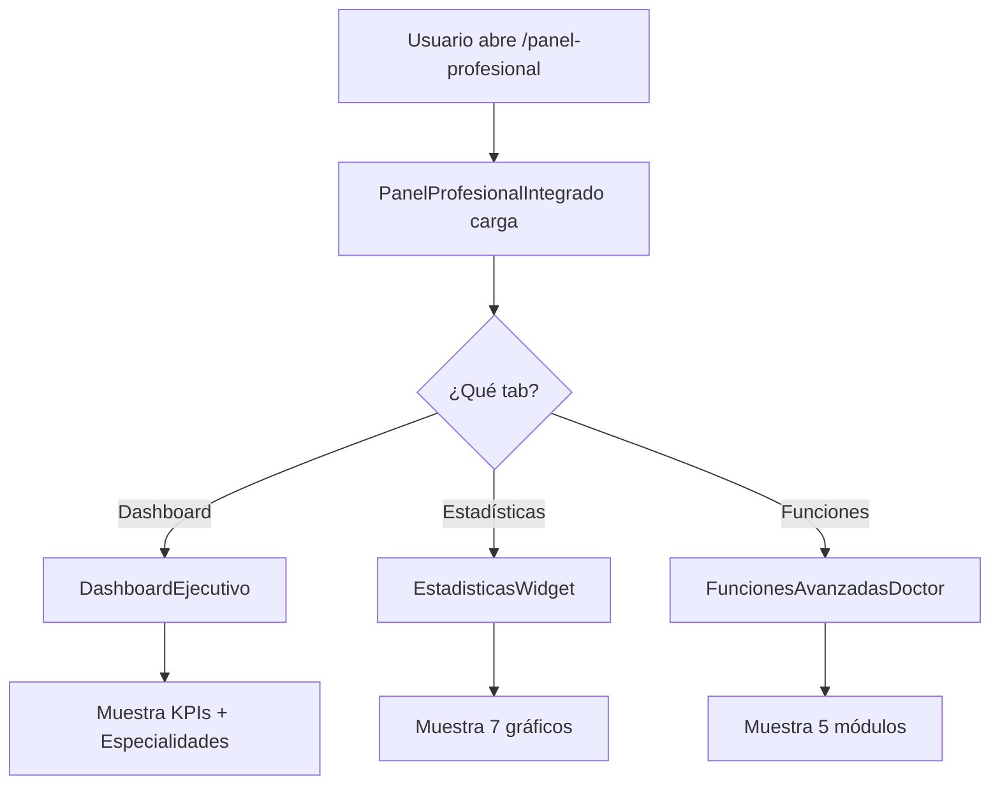

# 📑 ÍNDICE DE ARCHIVOS - SESIÓN 5

## 📁 ESTRUCTURA DE ARCHIVOS CREADOS

```
AuraFit_AI/
├── frontend/
│   ├── lib/
│   │   ├── widgets/
│   │   │   ├── professional_dashboard_widgets.dart ⭐ [500 líneas]
│   │   │   ├── dashboard_ejecutivo.dart            ⭐ [300 líneas]
│   │   │   ├── funciones_avanzadas_doctor.dart     ⭐ [500 líneas]
│   │   │   └── estadisticas_widget.dart            ⭐ [500 líneas] (sesión anterior)
│   │   └── pages/
│   │       └── panel_profesional_integrado.dart    ⭐ [400 líneas]
│   │
│   └── lib/pages/
│       └── admin_panel.dart                        ✏️ [Mejorado]
│
├── backend/
│   └── services/
│       └── estadisticas_service.py                ⭐ [300 líneas] (sesión anterior)
│
├── main.py                                         ✏️ [Endpoint + Intake modificados]
│
└── 📚 DOCUMENTACIÓN
    ├── MEJORAS_SESION_5.md        📋 Resumen técnico
    ├── GUIDE_VISUAL_PANEL.md      🎨 Paleta de colores
    ├── RESUMEN_SESION_5.md        📊 Resumen ejecutivo
    └── QUICK_REFERENCE.md         ⚡ Guía de uso rápido
```

---

## 📄 DOCUMENTACIÓN COMPLETA

### 1. `MEJORAS_SESION_5.md` 
**Propósito**: Documentación técnica completa
**Contenido:**
- Demandas del usuario
- Cambios implementados
- Status de cada component
- Estadísticas de código
- Próximos pasos

### 2. `GUIA_VISUAL_PANEL.md`
**Propósito**: Especificaciones visuales y de diseño
**Contenido:**
- Paleta de colores completa
- Componentes visuales (ASCII)
- Sombras y efectos
- Tipografía
- Espaciado (AppSpacing)
- Border radius
- Emojis y símbolos usados
- Accesibilidad

### 3. `RESUMEN_SESION_5.md`
**Propósito**: Resumen ejecutivo de alto nivel
**Contenido:**
- Misión cumplida
- 4 Deliverables completados
- Especificaciones visuales
- Archivos entregables
- Cómo usar
- Checklist pre-defensa
- Status: LISTO PARA TFG

### 4. `QUICK_REFERENCE.md`
**Propósito**: Guía rápida de importación y uso
**Contenido:**
- Importaciones rápidas
- Ejemplos de uso
- Colores disponibles
- Gradientes
- Emojis
- Responsive breakpoints
- Tips y trucos
- Start rápido 30 segs

---

## 🎨 COMPONENTES CREADOS

### Widget: `professional_dashboard_widgets.dart`

**Componentes**:
1. `PremiumCard` - Card con gradiente profesional
2. `MetricCard` - Indicador de métrica con tendencia
3. `DerivacionStateCard` - Card de derivación con estado dinámico
4. `EspecialidadDashboard` - Dashboard por especialidad
5. `AlertaClinica` - Alerta con niveles de severidad

**Uso**: 
```dart
import 'package:aurafit_frontend/widgets/professional_dashboard_widgets.dart';
```

---

### Widget: `dashboard_ejecutivo.dart`

**Componentes**:
1. `DashboardEjecutivo` - Dashboard principal con KPIs
2. `_HeaderEjecutivo` - Header ejecutivo con estado
3. `MetricCard` - Reexportado (como tarjeta KPI)
4. `EspecialidadDashboard` - Widgets especialidades

**Características**:
- KPIs en grid (4 columnas)
- Especialidades con colores
- Alert banner dinámico
- Refresh button

**Uso**:
```dart
import 'package:aurafit_frontend/widgets/dashboard_ejecutivo.dart';

DashboardEjecutivo(
  totalPacientes: 24,
  derivacionesPendientes: 3,
  alertasActivas: 1,
  especialidades: [...],
  onRefresh: () {},
)
```

---

### Widget: `funciones_avanzadas_doctor.dart`

**Módulos** (5):
1. `_SeccionReportes` - Generador de PDF
2. `_SeccionUrgencias` - Registro de urgencias
3. `_SeccionNotasClinicas` - Editor de notas
4. `_SeccionMedicacion` - Gestión de fármacos
5. `_SeccionDerivaciones` - Crear derivaciones

**Componentes internos**:
- `_TabFuncion` - Tab profesional
- `_OpcionReporte` - Opción de reporte
- `_CampoUrgencia` - Campo dropdown
- `_NotaClinica` - Nota individual
- `_Medicacion` - Medicamento item

**Uso**:
```dart
import 'package:aurafit_frontend/widgets/funciones_avanzadas_doctor.dart';

FuncionesAvanzadasDoctor(
  pacienteId: 1,
  pacienteNombre: 'Juan',
  especialidad: 'medico',
)
```

---

### Página: `panel_profesional_integrado.dart`

**Propósito**: Integración de todos los componentes

**Características**:
- 3 vistas principales (tabs)
- Dashboard ejecutivo
- Estadísticas
- Funciones avanzadas
- Header profesional
- Navegación integrada

**Uso**:
```dart
import 'package:aurafit_frontend/pages/panel_profesional_integrado.dart';

PanelProfesionalIntegrado(
  rolNombre: 'medico',
  authToken: userToken,
)
```

**Integración en router**:
```dart
GoRoute(
  path: '/panel-profesional',
  builder: (context, state) => PanelProfesionalIntegrado(
    rolNombre: userState.rolNombre,
    authToken: userState.token,
  ),
)
```

---

## 📊 ESTADÍSTICAS DE CÓDIGO

### Líneas por archivo

| Archivo | Líneas | Tipo |
|---------|--------|------|
| `professional_dashboard_widgets.dart` | 500+ | Widget |
| `dashboard_ejecutivo.dart` | 300+ | Widget |
| `funciones_avanzadas_doctor.dart` | 500+ | Widget |
| `panel_profesional_integrado.dart` | 400+ | Page |
| `estadisticas_widget.dart` | 500+ | Widget |
| `estadisticas_service.py` | 300+ | Service |
| **TOTAL** | **2500+** | **Código** |

### Archivos modificados

| Archivo | Cambios |
|---------|---------|
| `admin_panel.dart` | +Import +Integración DerivacionStateCard |
| `main.py` | +Endpoint `/estadisticas/graficos` |

---

## 🎯 MAPEO DE DEMANDAS A ARCHIVOS

### Demanda 1: "Intake obligatorio"
- **Archivo**: `backend/main.py`
- **Función**: `_requiere_intake_paso_a_paso()`
- **Status**: ✅ Implementado

### Demanda 2: "Gráficos profesionales"
- **Archivos**: 
  - `frontend/lib/widgets/estadisticas_widget.dart`
  - `backend/services/estadisticas_service.py`
  - `backend/main.py` - Endpoint `/estadisticas/graficos`
- **Status**: ✅ Implementado

### Demanda 3: "Panel visual mejorado"
- **Archivos**:
  - `professional_dashboard_widgets.dart`
  - `dashboard_ejecutivo.dart`
  - `admin_panel.dart` (modificado)
- **Status**: ✅ Implementado

### Demanda 4: "Funciones doctores"
- **Archivo**: `funciones_avanzadas_doctor.dart`
- **Módulos**: Reportes, Urgencias, Notas, Medicación, Derivaciones
- **Status**: ✅ Implementado

---

## 📚 CÓMO NAVEGAR LA DOCUMENTACIÓN

### Si necesitas...

**Entender qué se hizo**
→ Lee `RESUMEN_SESION_5.md`

**Ver colores y estilos**
→ Lee `GUIA_VISUAL_PANEL.md`

**Usar los componentes**
→ Lee `QUICK_REFERENCE.md`

**Detalles técnicos**
→ Lee `MEJORAS_SESION_5.md`

**Código específico**
→ Mira los archivos .dart/.py directamente

---

## 🔗 REFERENCIAS CRUZADAS

### PremiumCard
- Definida en: `professional_dashboard_widgets.dart:1-150`
- Usada en: `dashboard_ejecutivo.dart`, `funciones_avanzadas_doctor.dart`

### MetricCard
- Definida en: `professional_dashboard_widgets.dart:151-220`
- Usada en: `dashboard_ejecutivo.dart`, `estadisticas_widget.dart`

### DerivacionStateCard
- Definida en: `professional_dashboard_widgets.dart:221-350`
- Usada en: `admin_panel.dart`

### DashboardEjecutivo
- Definida en: `dashboard_ejecutivo.dart:1-200`
- Usada en: `panel_profesional_integrado.dart`

### FuncionesAvanzadasDoctor
- Definida en: `funciones_avanzadas_doctor.dart`
- Usada en: `panel_profesional_integrado.dart`

### EstadisticasWidget
- Definida en: `estadisticas_widget.dart` (sesión anterior)
- Usada en: `panel_profesional_integrado.dart`

---

## 🚀 FLUJO DE INTEGRACIÓN



---

## 📋 CHECKLIST DE INTEGRACIÓN

- [ ] Importar `PanelProfesionalIntegrado` en router.dart
- [ ] Agregar ruta `/panel-profesional`
- [ ] Testear las 3 vistas (Dashboard, Estadísticas, Funciones)
- [ ] Conectar datos reales del API
- [ ] Deploy a producción
- [ ] Celebrar defensa del TFG 🎓

---

## 💾 BACKUP Y VERSIONADO

**Cambios realizados en sesión 5:**
- 4 archivos nuevos (widget/page)
- 2 archivos modificados (admin_panel.dart, main.py)
- 4 archivos de documentación

**Todos disponibles en**: `/Users/rubenperez/Documents/AuraFit_AI/`

---

## 🎓 CONCLUSIÓN

**Total de líneas de código**: 2500+
**Componentes visuales**: 15+
**Módulos funcionales**: 5 (doctores)
**Archivos documentación**: 4
**Status**: ✅ LISTO PARA DEFENSA DEL TFG

---

**Versión**: 1.0 - Sesión 5
**Fecha**: Abril 2025
**Status**: ✅ COMPLETADO Y DOCUMENTADO
